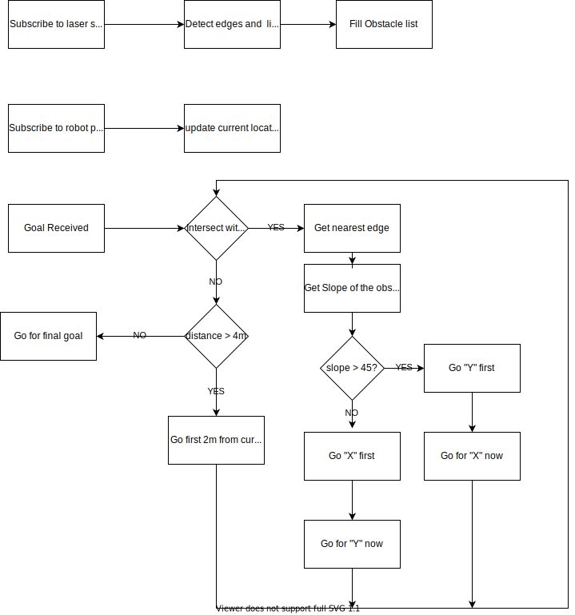

# PX4 Planner

## Setting up environment

Setup PX4-Autopilot from [here](https://docs.px4.io/master/en/simulation/) 

Test by running this command

```bash
cd $PX4_REPO
DONT_RUN=1 make px4_sitl_default gazebo
```

Make sure you have PX4-Autopilot built and mavros and mavlink packages built in your default catkin_ws

### Setting up bashrc 

Add this to ~/.bashrc and make sure to get the PX4_REPO path correct

```bash
export PX4_REPO=$HOME/PX4-Autopilot
source $PX4_REPO/Tools/setup_gazebo.bash $PX4_REPO $PX4_REPO/build/px4_sitl_default
export ROS_PACKAGE_PATH=$ROS_PACKAGE_PATH:$PX4_REPO
export ROS_PACKAGE_PATH=$ROS_PACKAGE_PATH:$PX4_REPO/Tools/sitl_gazebo
```

Now clone px4_planner package to catkin_ws and build

```bash
git clone https://github.com/krish-iyer/px4_planner.git ~/catkin_ws/src/px4_planner
catkin_make_isolated 
```

### Loading world in gazebo

```bash
vim $PX4_REPO/launch/posix_sitl.launch
```

Now change this

```xml
    <arg name="world" default="$(find mavlink_sitl_gazebo)/worlds/empty.world"/> 
```

to (**note**: replace "PATH_TO_CATKIN_WS" with actual path)

```xml
    <arg name="world" default="PATH_TO_CATKIN_WS/catkin_ws/src/px4_planner/worlds/px4_planner.world"/>
```

### Launch the world

Launch gazebo with px4 sitl

```bash
roslaunch px4 posix_sitl.launch vehicle:=iris_rplidar
```

Launch mavros

```bash
roslaunch mavros px4.launch fcu_url:="udp://:14540@127.0.0.1:14557"
```

### Launch px4_planner

```bash
cd ~/catkin_ws
source ~/catkin_ws/devel_isolated/setup.bash
roslaunch px4_planner planner.py
```

### Launch camera streaming (**note**: if camera is supported)

```bash
gst-launch-1.0  -v udpsrc port=5600 caps='application/x-rtp, media=(string)video, clock-rate=(int)90000, encoding-name=(string)H264' \
! rtph264depay ! avdec_h264 ! videoconvert ! autovideosink fps-update-interval=1000 sync=false

```

### Try sending waypoints

```bash
rosrun px4_planner test_waypoints.py
```

## How does it work?


